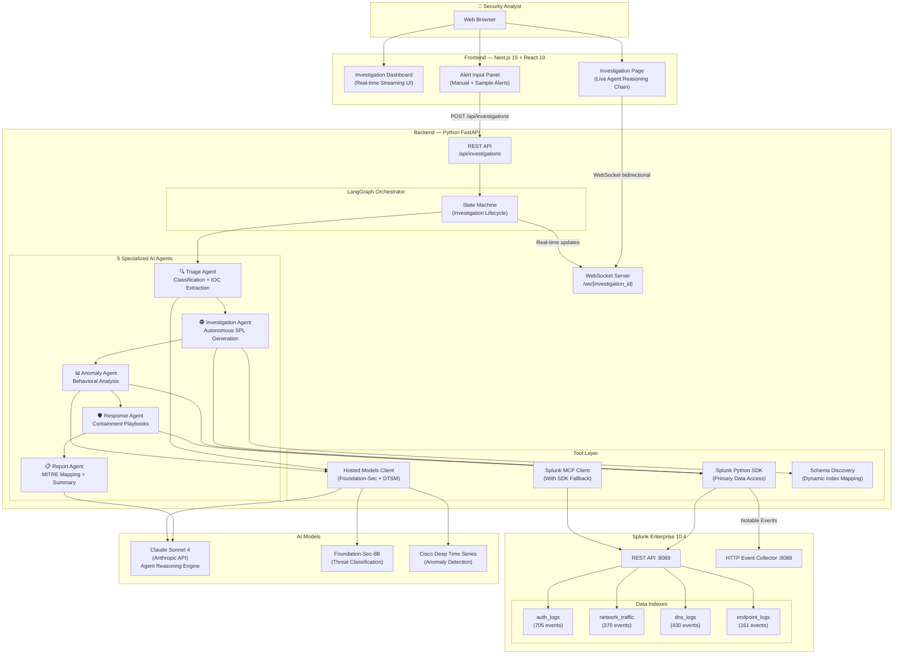
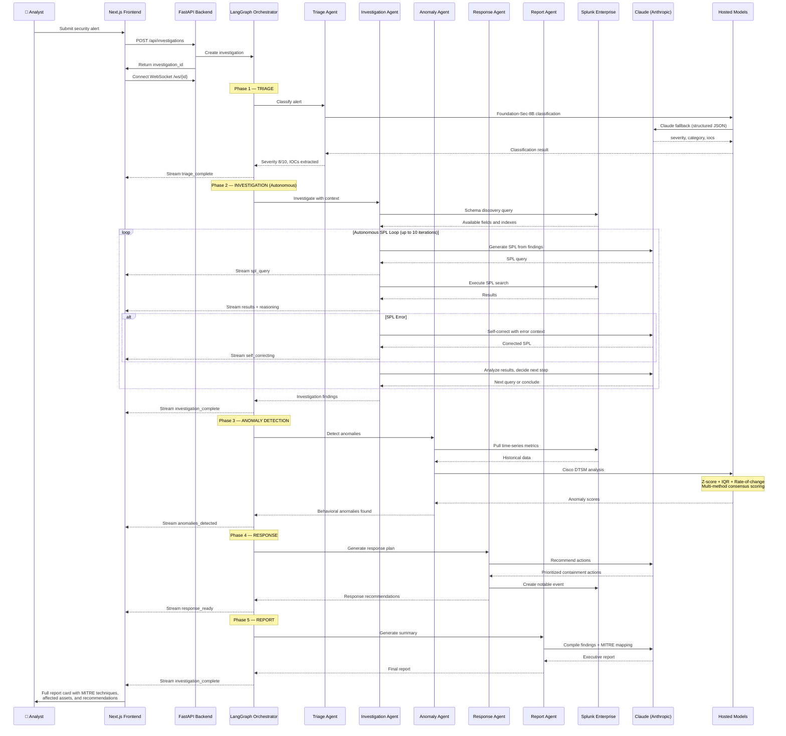
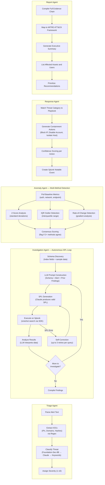
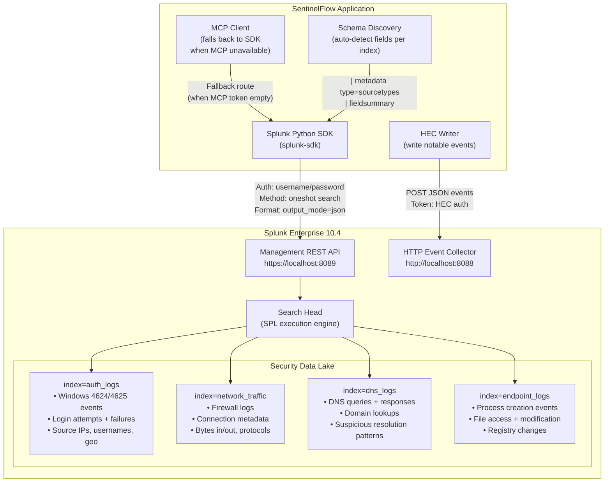
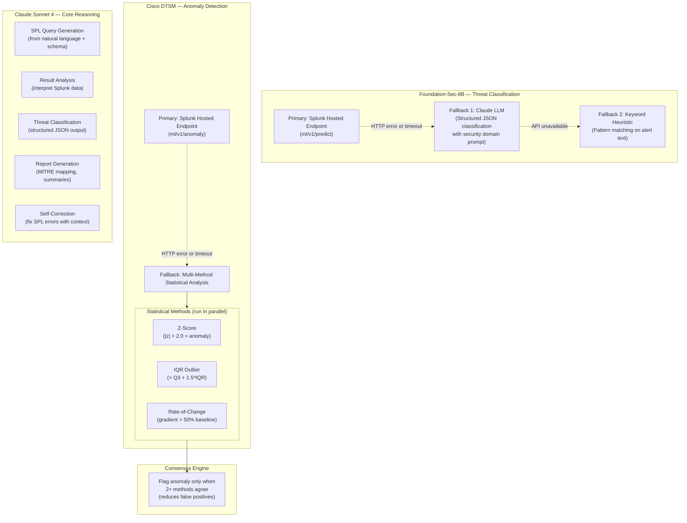
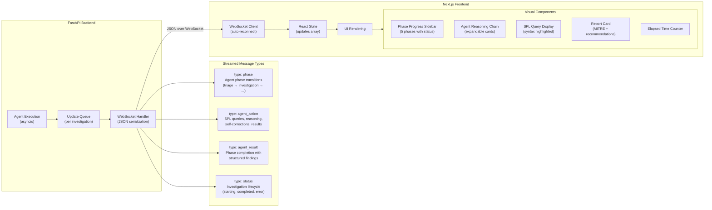
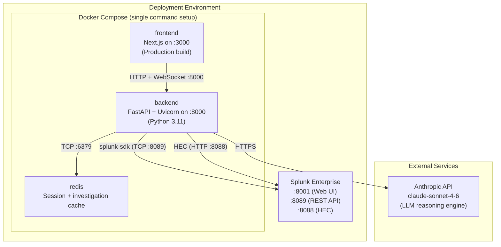

# SentinelFlow — Architecture Diagram

## System Overview

SentinelFlow is an autonomous multi-agent AI Security Operations system that investigates security alerts end-to-end — triaging, correlating, detecting anomalies, and recommending responses — with full real-time transparency via WebSocket streaming.

---

## Data Flow: End-to-End Investigation

This sequence diagram shows the complete lifecycle of an autonomous security investigation, from alert submission to final report delivery.

---

## Agent Architecture Detail

Each of the 5 agents has a specialized role with clear inputs, processing logic, and outputs:

---

## Splunk Integration Architecture

Shows how the application accesses Splunk data via the Python SDK (primary) and MCP Client (with SDK fallback):

---

## AI Model Integration — Fallback Chain

Every external AI capability has graceful degradation. If the primary service is unavailable, the system falls back to alternatives without failing:

---

## Real-Time Streaming Architecture

Every agent action is streamed to the frontend in real-time, providing full transparency into the AI's reasoning process:

---

## Deployment Architecture

---

## Technology Stack

| Layer | Technology | Role in SentinelFlow |
|-------|-----------|------|
| **Frontend** | Next.js 15, React 19, Tailwind CSS, Lucide Icons | Real-time investigation dashboard with WebSocket streaming |
| **Backend** | Python 3.11, FastAPI, Uvicorn | REST API + WebSocket server hosting all agents |
| **Agent Framework** | LangGraph (LangChain) | Multi-agent state machine orchestration with phase transitions |
| **Primary LLM** | Claude Sonnet 4 (Anthropic) | Agent reasoning, SPL generation, result analysis, reports |
| **Security AI** | Foundation-Sec-8B (Splunk Hosted) | Threat classification, severity scoring, IOC extraction |
| **Time Series AI** | Cisco DTSM (Splunk Hosted) | Multi-method anomaly detection with consensus scoring |
| **Data Platform** | Splunk Enterprise 10.4 | Security data lake — auth, network, DNS, endpoint logs |
| **Splunk Access** | Splunk Python SDK + MCP Client | Query execution (oneshot), event writing, schema discovery |
| **Caching** | Redis | Investigation state persistence, response caching |
| **Deployment** | Docker Compose | Single `docker-compose up` setup for judges |

---

## Key Design Decisions

| Decision | Rationale |
|----------|-----------|
| **Autonomous Investigation Loop** | Investigation Agent runs up to 10 SPL queries iteratively with self-correction (3 retries). No human intervention needed for standard investigations. |
| **Graceful Degradation** | Every external service has a fallback: MCP → SDK, Foundation-Sec → Claude → Keywords, DTSM → Statistical methods. System never fails due to a single service outage. |
| **Real-Time Transparency** | Every agent thought, SPL query, and decision is streamed via WebSocket. Judges see the AI reason live — this is the core differentiator. |
| **Schema-Aware SPL Generation** | Before generating queries, the system discovers available indexes, fields, and sample data to produce valid SPL on the first attempt. |
| **Multi-Method Consensus** | Anomaly detection uses 3 independent statistical methods. An anomaly is flagged only when ≥2 methods agree, reducing false positives. |
| **MITRE ATT&CK Mapping** | Every finding is mapped to MITRE techniques, providing standardized threat intelligence that security teams expect. |
